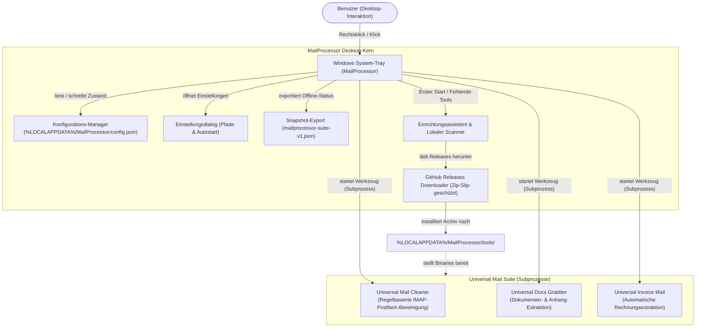
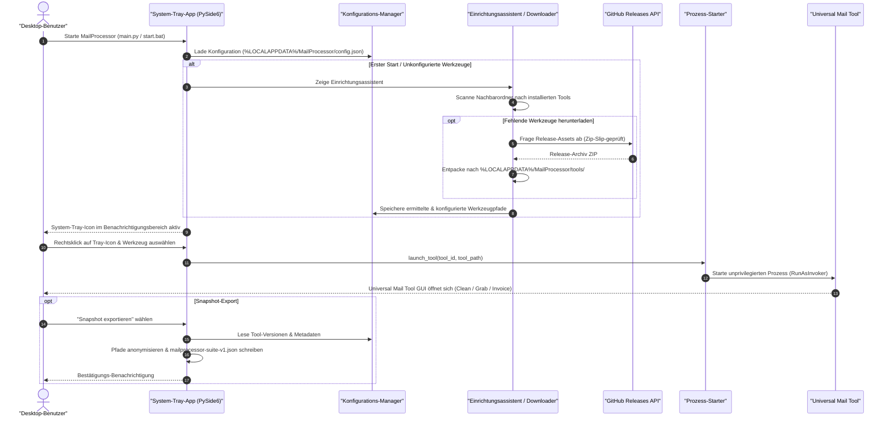

# MailProcessor

<p align="center">
  
</p>

System-Tray-Launcher für die drei Universal Mail Tools.

> **Sprache:** [English](README.md) · [Deutsch](README-DE.md)

[](https://github.com/doc-bricks/MailProcessor/actions/workflows/tests.yml)
[](CHANGELOG.md)
[](https://www.python.org/downloads/)
[-0078D6.svg?logo=windows&logoColor=white)](https://github.com/doc-bricks/MailProcessor)
[](https://pypi.org/project/PySide6/)
[](tests/)
[](SECURITY.md)
[](SECURITY.md)
[](SECURITY.md)
[](https://github.com/astral-sh/ruff)
[](https://github.com/open-bricks)
[](llms.txt)
[](https://opensource.org/licenses/MIT)

> [!NOTE]
> Für KI-Agenten und automatisierte Werkzeuge sind wichtige Architektur- und Schnittstellen-Metadaten in [llms.txt](llms.txt) strukturiert aufbereitet.

---

### Schnellnavigation

- [Was es tut](#was-es-tut)
- [Funktionen & Features](#features)
- [Systemarchitektur & Workflow](#systemarchitektur--workflow)
- [Lebenszyklus & Ausführungssequenz](#lebenszyklus--ausführungssequenz)
- [Installation](#installation)
- [Windows-Release](#windows-release)
- [Plattformumfang](#plattformumfang)
- [Governance & Laufzeit-Invarianten](#governance--laufzeit-invarianten)
- [Voraussetzungen](#voraussetzungen)
- [Entwicklungsprüfungen](#entwicklungsprüfungen)
- [Konfiguration](#konfiguration)
- [Verwandte Werkzeuge](#verwandte-werkzeuge)
- [Lizenz](#lizenz)

---


## Was es tut

MailProcessor sitzt im Windows-System-Tray und gibt per Rechtsklick Zugang zu:

- **Universal Mail Cleaner** — IMAP-Postfach nach Regeln bereinigen
- **Universal Docs Grabber** — Dokumente und Anhänge aus Mails laden
- **Universal Invoice Mail** — Rechnungen automatisch aus Mails extrahieren

## Features

- System-Tray-Icon: per Rechtsklick jederzeit ein Tool starten
- Erster Start: Einrichtungsassistent mit automatischem Scan nach vorhandenen Tools
- GitHub-Installer: Tools direkt aus GitHub Releases herunterladen
- Versionsnummern im Tray-Menü (aus CHANGELOG.md jedes Tools)
- Einstellungen: Pfade anpassen, Tools entfernen, manuell hinzufügen
- Read-only-Snapshot als `mailprocessor-suite-v1.json` für eine lokale Referenz exportieren; kein Web- oder Mobile-Companion ist aktiv
- Autostart mit Windows (Registry-Eintrag)
- Zweisprachig: Deutsch / Englisch

## Systemarchitektur & Workflow



## Lebenszyklus & Ausführungssequenz



## Installation

1. Python 3.10+ installieren
2. Abhängigkeiten installieren:
   ```bash
   pip install -r requirements.txt
   ```
3. Starten:
   ```bash
   start.bat
   ```
   oder
   ```bash
   python main.py
   ```
4. Im Einrichtungsassistenten die gewünschten Tools auswählen

## Windows-Release

- Lokale Release-Artefakte liegen in `releases/v0.1.0/`
- Die Windows-EXE wird mit `build_exe.bat` neu erzeugt
- Das Paket heißt `MailProcessor-0.1.0-desktop.exe`

### Microsoft-Store-Readiness

Der Microsoft Store ist derzeit **zurückgestellt**. MailProcessor startet
externe Desktop-Prozesse, schreibt den nutzerbezogenen Autostart-Eintrag und
lädt ausgewählte GitHub-Release-Archive herunter. Ein Paket benötigt daher
`runFullTrust` und `internetClient` sowie ein separates Datenschutz-, Paket- und
Zertifizierungsreview.

Das schreibfreie Gate ist für Menschen und Automationen nutzbar und kann
stabiles JSON ausgeben:

```bash
python store_readiness.py --release-dir <vorhandener-vX.Y.Z-Releaseordner>
python store_readiness.py --release-dir <vorhandener-vX.Y.Z-Releaseordner> --json
```

Exit-Code `0` bedeutet, dass alle Gates bestanden wurden. Exit-Code `2`
signalisiert mindestens einen Blocker. Das Audit baut, signiert, lädt oder
übermittelt kein Paket.

## Plattformumfang

MailProcessor ist ein Windows-Desktop-Tray-Launcher. Der frühere Web-/PWA-Companion
wurde nach seiner Nutzenprüfung bewusst entfernt; der bereinigte Snapshot ist
keine Synchronisationsschnittstelle oder ein mobiles Produkt. macOS und Linux
besitzen ausschließlich einen Quelltextvertrag, kein gepacktes Endbenutzer-Release;
der reproduzierbare Test und die expliziten Nicht-Ziele sind in
[MACOS_LINUX_SOURCE_SMOKE.md](MACOS_LINUX_SOURCE_SMOKE.md) dokumentiert.
Android/iOS, Capacitor und Serversynchronisation besitzen keine aktive Produktfläche.
Eine künftige native oder Geräte-Zusage erfordert eine neue Produktentscheidung sowie
eigene Build- und Emulator-Freigaben. Store-Blocker und die nächsten Prüfschritte
werden in [RELEASES.md](RELEASES.md#current-platform-scope-2026-08-26) nachverfolgt.

## Governance & Laufzeit-Invarianten

Die folgenden Invarianten definieren die Betriebs- und Sicherheitsgarantien von MailProcessor:

| Invarianten-ID | Bezeichnung | Richtlinie / Standard | Verifikation & Garantie |
|---|---|---|---|
| `INV-LOCAL-01` | **100% Local-First & Zero Egress** | Offline-Datenschutzstandard | Läuft vollständig auf dem lokalen System. Keine Telemetrie, keine Cloud-Weiterleitung, keine Speicherung von Mail-Inhalten, Passwörtern oder Zugangsdaten. |
| `INV-NOELEV-02` | **Keine Rechteerweiterung (RunAsInvoker)** | Windows Least-Privilege-Prinzip | Läuft ausnahmslos als Standardbenutzer ohne UAC-Elevation (`runAsInvoker`). |
| `INV-ZIPSLIP-03` | **Zip-Slip-Schutz gegen Pfadüberquerung** | CWE-22 Sicherheitsstandard | GitHub-Release-Downloads validieren alle Archivpfade vor dem Entpacken, um Verzeichnisüberquerungen auszuschließen. |
| `INV-CFGISO-04` | **Lokale AppData-Isolation** | Windows AppData Konvention | Konfiguration liegt isoliert unter `%LOCALAPPDATA%\MailProcessor\config.json`. Keine Registry-Verschmutzung außer dem optionalen Benutzer-Autostart. |
| `INV-PROCLIF-05` | **Sicherer Subprozess-Lebenszyklus** | Saubere Prozess-Entkopplung | Startet Universal Mail Tools als losgelöste unprivilegierte Subprozesse (`subprocess.Popen`), wodurch Blockaden des Trays verhindert werden. |
| `INV-REDACT-06` | **Deterministische Snapshot-Anonymisierung** | Datenminimierung | Der `mailprocessor-suite-v1.json`-Export bereinigt benutzerspezifische absolute Pfade für den sicheren Offline-Austausch. |
| `INV-OSPAR-07` | **Plattform-Smoke-Vertrag** | Multi-OS Quelltext-Integrität | Primäre Ziellaufzeit ist Windows Desktop Tray; Multi-OS-Matrix prüft Quelltext-Kompatibilität unter Ubuntu und macOS. |
| `INV-SLA-08` | **Sicherheitsreaktions- & Triage-SLA** | Responsible Disclosure | 48-Stunden-Reaktions-SLA und 5-Werktage-Triage über `security@ellmos.ai` und GitHub Security Advisories. |

## Voraussetzungen

- Python 3.10+
- PySide6 6.x
- Ein oder mehrere Universal Mail Tools (automatisch per Assistent ladbar)

## Entwicklungsprüfungen

```bash
python -m pytest -q
python -m compileall .
```

Aktuelle lokale Testsuite: 79 Pytest-Tests.

## Konfiguration

Die Einstellungen werden in `%LOCALAPPDATA%\MailProcessor\config.json` gespeichert.

Tools werden nach `%LOCALAPPDATA%\MailProcessor\tools\` installiert.

## Verwandte Werkzeuge

Teil der [doc-bricks](https://github.com/doc-bricks) Mail-Suite und des [open-bricks](https://github.com/open-bricks) Dachverbands:

| Werkzeug | Kategorie | Rolle & Beschreibung | Status | Repositorium |
|----------|-----------|----------------------|--------|--------------|
| [UniversalMailCleaner](https://github.com/doc-bricks/UniversalMailCleaner) | Mail-Hygiene | Regelbasierte IMAP-Postfachbereinigung mit Sicherheitsmodus | Aktiv / Unterstützt | `doc-bricks/UniversalMailCleaner` |
| [UniversalDocsGrabber](https://github.com/doc-bricks/UniversalDocsGrabber) | Mail-Extraktion | Dokumente und Anhänge aus IMAP-Postfächern extrahieren | Aktiv / Unterstützt | `doc-bricks/UniversalDocsGrabber` |
| [UniversalInvoiceMail](https://github.com/doc-bricks/UniversalInvoiceMail) | Mail-Extraktion | Rechnungen und Belege automatisch aus IMAP-Mails extrahieren | Aktiv / Unterstützt | `doc-bricks/UniversalInvoiceMail` |
| [FormularErstellen](https://github.com/doc-bricks/FormularErstellen) | Dokumenten-Tools | Interaktiver Formular-Generator und Vorlagen-Engine | Schwesterwerkzeug | `doc-bricks/FormularErstellen` |
| [PDFtoPDFocr](https://github.com/doc-bricks/PDFtoPDFocr) | Dokumenten-OCR | Durchsuchbare PDF-OCR-Pipeline und Texterkennung | Schwesterwerkzeug | `doc-bricks/PDFtoPDFocr` |
| [DokuZen](https://github.com/doc-bricks/DokuZen) | Wissens-Hub | Desktop-Dokumentenorganizer, Dateiklassifizierer und Wissens-Hub | Schwesterwerkzeug | `doc-bricks/DokuZen` |
| [open-bricks](https://github.com/open-bricks) | Dachverband | Dachorganisation des Ökosystems, gemeinsame Richtlinien und Katalog | Dachverband | `open-bricks/open-bricks` |

## Lizenz

MIT License — siehe [LICENSE](LICENSE)
