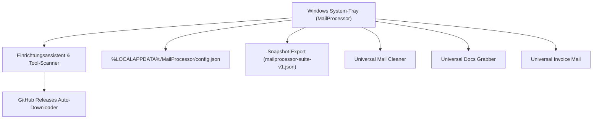

# MailProcessor

<p align="center">
  
</p>

System-Tray-Launcher für die drei Universal Mail Tools.

> **English documentation:** [README.md](README.md)

[](https://github.com/doc-bricks/MailProcessor/actions/workflows/tests.yml)
[](https://www.python.org/downloads/)
[](https://opensource.org/licenses/MIT)
[](llms.txt)

> [!NOTE]
> Für KI-Agenten und automatisierte Werkzeuge sind wichtige Architektur- und Schnittstellen-Metadaten in [llms.txt](llms.txt) strukturiert aufbereitet.


## Was es tut

MailProcessor sitzt im Windows-System-Tray und gibt per Rechtsklick Zugang zu:

- **Universal Mail Cleaner** — IMAP-Postfach nach Regeln bereinigen
- **Universal Docs Grabber** — Dokumente und Anhänge aus Mails laden
- **Universal Invoice Mail** — Rechnungen automatisch aus Mails extrahieren

## Features

- System-Tray-Icon: per Rechtsklick jederzeit ein Tool starten
- Erster Start: Einrichtungsassistent mit automatischem Scan nach vorhandenen Tools
- GitHub-Installer: Tools direkt aus GitHub Releases herunterladen
- Versionsnummern im Tray-Menü (aus CHANGELOG.md jedes Tools)
- Einstellungen: Pfade anpassen, Tools entfernen, manuell hinzufügen
- Read-only-Snapshot als `mailprocessor-suite-v1.json` für eine lokale Referenz exportieren; kein Web- oder Mobile-Companion ist aktiv
- Autostart mit Windows (Registry-Eintrag)
- Zweisprachig: Deutsch / Englisch

## Systemarchitektur & Workflow



## Installation

1. Python 3.10+ installieren
2. Abhängigkeiten installieren:
   ```bash
   pip install -r requirements.txt
   ```
3. Starten:
   ```bash
   start.bat
   ```
   oder
   ```bash
   python main.py
   ```
4. Im Einrichtungsassistenten die gewünschten Tools auswählen

## Windows-Release

- Lokale Release-Artefakte liegen in `releases/v0.1.0/`
- Die Windows-EXE wird mit `build_exe.bat` neu erzeugt
- Das Paket heißt `MailProcessor-0.1.0-desktop.exe`

## Plattformumfang

MailProcessor ist ein Windows-Desktop-Tray-Launcher. Der frühere Web-/PWA-
Companion wurde nach der Usecase-Prüfung bewusst entfernt; der redigierte
Snapshot ist weder eine Synchronisationsschnittstelle noch ein mobiles Produkt.
Für macOS und Linux existiert nur ein Quellcodevertrag, keine paketierte
Endnutzer-Distribution.

## Voraussetzungen

- Python 3.10+
- PySide6 6.x
- Eines oder mehrere der Universal Mail Tools (automatisch per Assistent herunterladbar)

## Entwicklungschecks

```bash
python -m pytest -q
python -m compileall .
```

Aktuelle lokale Testsuite: 60 Pytest-Tests.

## Konfiguration

Einstellungen werden in `%LOCALAPPDATA%\MailProcessor\config.json` gespeichert.

Tools werden in `%LOCALAPPDATA%\MailProcessor\tools\` installiert.

## Verwandte Tools

Teil der [doc-bricks](https://github.com/doc-bricks) Mail-Suite:

| Tool | Beschreibung |
|------|--------------|
| [UniversalMailCleaner](https://github.com/doc-bricks/UniversalMailCleaner) | Regelbasierter IMAP-Cleaner mit Safe-Mode |
| [UniversalDocsGrabber](https://github.com/doc-bricks/UniversalDocsGrabber) | Dokumente und Anhänge aus IMAP-Mails herunterladen |
| [UniversalInvoiceMail](https://github.com/doc-bricks/UniversalInvoiceMail) | Rechnungen und Belege automatisch aus Mails extrahieren |

## Lizenz

MIT-Lizenz — siehe [LICENSE](LICENSE)
