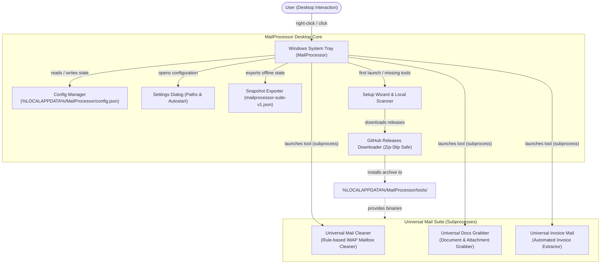
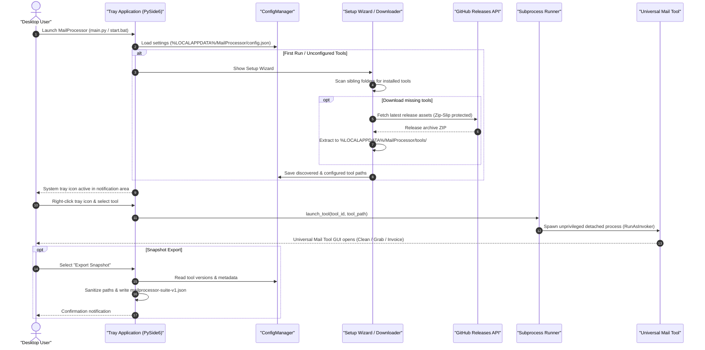

# MailProcessor

<p align="center">
  
</p>

System tray launcher for the three Universal Mail Tools.

> **Language:** [English](README.md) · [Deutsch](README-DE.md)

[](https://github.com/doc-bricks/MailProcessor/actions/workflows/tests.yml)
[](CHANGELOG.md)
[](https://www.python.org/downloads/)
[-0078D6.svg?logo=windows&logoColor=white)](https://github.com/doc-bricks/MailProcessor)
[](https://pypi.org/project/PySide6/)
[](tests/)
[](SECURITY.md)
[](SECURITY.md)
[](SECURITY.md)
[](https://github.com/astral-sh/ruff)
[](https://github.com/open-bricks)
[](llms.txt)
[](https://opensource.org/licenses/MIT)

> [!NOTE]
> For AI agents and automated tools, key architecture and interface metadata are indexed in [llms.txt](llms.txt).

---

### Quick Navigation

- [What it does](#what-it-does)
- [Features](#features)
- [System Architecture & Workflow](#system-architecture--workflow)
- [Lifecycle & Execution Sequence](#lifecycle--execution-sequence)
- [Installation](#installation)
- [Windows Release](#windows-release)
- [Platform Scope](#platform-scope)
- [Governance & Runtime Invariants](#governance--runtime-invariants)
- [Requirements](#requirements)
- [Development Checks](#development-checks)
- [Configuration](#configuration)
- [Related Tools](#related-tools)
- [License](#license)

---


## What it does

MailProcessor sits in the Windows system tray and gives you one-click access to:

- **Universal Mail Cleaner** — Clean an IMAP mailbox by rules
- **Universal Docs Grabber** — Download documents and attachments from mail
- **Universal Invoice Mail** — Extract invoices automatically from mail

## Features

- System tray icon: launch any tool via right-click at any time
- First run: setup wizard with automatic scan for installed tools
- GitHub installer: download tools directly from GitHub Releases
- Version numbers shown in tray menu (read from each tool's CHANGELOG.md)
- Settings: change paths, remove tools, add manually
- Read-only snapshot export as `mailprocessor-suite-v1.json` for local reference; no web or mobile companion is active
- Windows autostart (registry entry)
- Bilingual: German / English

## System Architecture & Workflow



## Lifecycle & Execution Sequence



## Installation

1. Install Python 3.10+
2. Install dependencies:
   ```bash
   pip install -r requirements.txt
   ```
3. Launch:
   ```bash
   start.bat
   ```
   or
   ```bash
   python main.py
   ```
4. Select the desired tools in the setup wizard

## Windows Release

- Local release artifacts are staged in `releases/v0.1.0/`
- Rebuild the Windows executable with `build_exe.bat`
- The packaged binary is named `MailProcessor-0.1.0-desktop.exe`

### Microsoft Store readiness

The Microsoft Store is currently **deferred**. MailProcessor launches external
desktop processes, writes its per-user autostart entry, and downloads selected
GitHub release archives, so any package requires both `runFullTrust` and
`internetClient` plus a separate privacy, packaging, and certification review.

The read-only gate can be run by humans or automation and emits stable JSON:

```bash
python store_readiness.py --release-dir <existing-vX.Y.Z-release-folder>
python store_readiness.py --release-dir <existing-vX.Y.Z-release-folder> --json
```

Exit code `0` means every gate passed; exit code `2` means at least one blocker
remains. The audit never builds, signs, uploads, or submits a package.

## Platform Scope

MailProcessor is a Windows desktop tray launcher. The former web/PWA companion
was intentionally removed after its use-case review; the redacted snapshot is
not a synchronization interface or a mobile product. macOS and Linux retain a
source-level contract only, not a packaged end-user release; its reproducible
check and explicit non-goals are documented in
[MACOS_LINUX_SOURCE_SMOKE.md](MACOS_LINUX_SOURCE_SMOKE.md). Android/iOS,
Capacitor, and server synchronization have no active product surface. A future
native or device claim requires a new product decision plus its own build and
device/emulator acceptance. Store blockers and the next required evidence are
tracked in [RELEASES.md](RELEASES.md#current-platform-scope-2026-08-26).

## Governance & Runtime Invariants

The following invariants define the operational and security guarantees of MailProcessor:

| Invariant ID | Name | Standard / Policy | Verification & Guarantee |
|---|---|---|---|
| `INV-LOCAL-01` | **100% Local-First & Zero Egress** | Offline Privacy Standard | Operates entirely on the local machine. No telemetry, no background analytics, no cloud relay, and zero storage of email content, passwords, or credentials. |
| `INV-NOELEV-02` | **Non-Elevation & RunAsInvoker** | Windows Least Privilege | Runs exclusively as standard unprivileged user. Never requests UAC elevation (`runAsInvoker`). |
| `INV-ZIPSLIP-03` | **Zip-Slip Traversal Defense** | CWE-22 Security Standard | Tool downloads from GitHub releases validate archive member paths to prevent directory traversal attacks before extraction. |
| `INV-CFGISO-04` | **Local AppData Isolation** | Windows AppData Convention | Configuration is isolated under `%LOCALAPPDATA%\MailProcessor\config.json`. No registry pollution except optional per-user autostart entry. |
| `INV-PROCLIF-05` | **Safe Subprocess Lifecycle** | Clean Process Separation | Launches Universal Mail Tools via detached unprivileged subprocesses (`subprocess.Popen`) preventing parent tray lockups or cascaded crashes. |
| `INV-REDACT-06` | **Deterministic Snapshot Redaction** | Data Minimization | `mailprocessor-suite-v1.json` exports redact machine-specific absolute paths to protect user privacy in shared or offline bug reports. |
| `INV-OSPAR-07` | **Cross-Platform Source Smoke Contract** | Multi-OS Integrity | Primary product surface is Windows Desktop Tray; multi-platform smoke test matrix verifies source-level compatibility across Ubuntu and macOS. |
| `INV-SLA-08` | **Security Response & Triage SLA** | Responsible Disclosure | 48-hour response SLA and 5-business-day triage commitment through `security@ellmos.ai` and GitHub Security Advisories. |

## Requirements

- Python 3.10+
- PySide6 6.x
- One or more Universal Mail Tools (auto-downloaded via wizard)

## Development Checks

```bash
python -m pytest -q
python -m compileall .
```

Current local test suite: 79 Pytest tests.

## Configuration

Settings are stored in `%LOCALAPPDATA%\MailProcessor\config.json`.

Tools are installed to `%LOCALAPPDATA%\MailProcessor\tools\`.

## Related Tools

Part of the [doc-bricks](https://github.com/doc-bricks) mail suite and [open-bricks](https://github.com/open-bricks) umbrella:

| Tool | Category | Role & Description | Status | Repository |
|------|----------|-------------------|--------|------------|
| [UniversalMailCleaner](https://github.com/doc-bricks/UniversalMailCleaner) | Mail Hygiene | Rule-based IMAP mailbox cleaner with safe mode | Active / Supported | `doc-bricks/UniversalMailCleaner` |
| [UniversalDocsGrabber](https://github.com/doc-bricks/UniversalDocsGrabber) | Mail Extraction | Download documents and attachments from IMAP mail | Active / Supported | `doc-bricks/UniversalDocsGrabber` |
| [UniversalInvoiceMail](https://github.com/doc-bricks/UniversalInvoiceMail) | Mail Extraction | Extract invoices and receipts automatically from IMAP mail | Active / Supported | `doc-bricks/UniversalInvoiceMail` |
| [FormularErstellen](https://github.com/doc-bricks/FormularErstellen) | Document Tools | Interactive form generator and document template engine | Sibling Tool | `doc-bricks/FormularErstellen` |
| [PDFtoPDFocr](https://github.com/doc-bricks/PDFtoPDFocr) | Document OCR | Searchable PDF OCR pipeline and document text recognition | Sibling Tool | `doc-bricks/PDFtoPDFocr` |
| [DokuZen](https://github.com/doc-bricks/DokuZen) | Knowledge Hub | Desktop document organizer, file classifier, and knowledge hub | Sibling Tool | `doc-bricks/DokuZen` |
| [open-bricks](https://github.com/open-bricks) | Umbrella | Umbrella ecosystem, shared policies, and open-source catalog | Umbrella Hub | `open-bricks/open-bricks` |

## License

MIT License — see [LICENSE](LICENSE)
